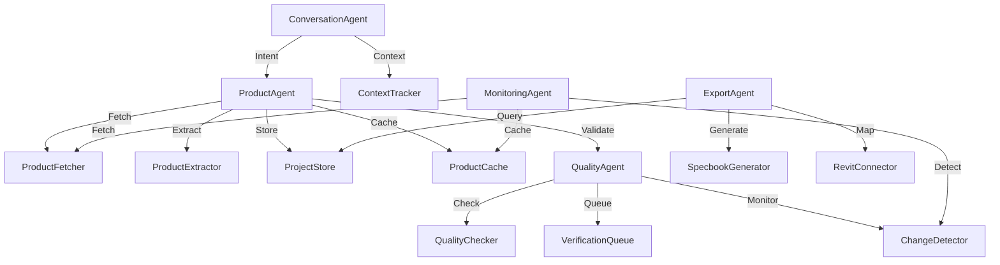

# Agent Tool Specification for Specbook Automation

## 1. Core Architectural Use Cases

### **Primary Use Cases**
1. **Product Discovery & Collection** - "Add these 30 bathroom fixtures to the Desert Modern project"
2. **Product Updates & Maintenance** - "The Kohler faucet is discontinued, find alternatives"
3. **Specbook Generation** - "Generate the kitchen appliances spec sheet for client review"
4. **Multi-Project Management** - "Show me all pending products across active projects"
5. **Quality Assurance** - "Verify all products in the master bedroom are still available"

---

## 2. Required Tools Specification

### **Data Management Tools**

#### **ProjectStore**
```python
class ProjectStore:
    """Persistent storage for projects and products"""
    
    def create_project(self, name: str, metadata: dict) -> ProjectID
    def add_product(self, project_id: ProjectID, product: Product) -> ProductID
    def update_product(self, product_id: ProductID, updates: dict) -> Product
    def get_products(self, project_id: ProjectID, filters: dict) -> List[Product]
    def search_products(self, query: str) -> List[Product]
```
- **Purpose**: Central data persistence with project isolation
- **Interface**: CRUD operations with filtering and search
- **Dependencies**: PostgreSQL with SQLAlchemy ORM

#### **ProductCache**
```python
class ProductCache:
    """High-speed product data caching"""
    
    def get(self, url: str) -> Optional[CachedProduct]
    def set(self, url: str, data: Product, ttl: int = 3600)
    def invalidate(self, url: str)
    def get_similar(self, product: Product, limit: int = 5) -> List[Product]
```
- **Purpose**: Reduce redundant scraping, enable similarity search
- **Interface**: Redis-backed cache with TTL and similarity vectors
- **Dependencies**: Redis with vector search extension

### **Natural Language Tools**

#### **IntentParser**
```python
class IntentParser:
    """Convert natural language to structured intents"""
    
    def parse(self, message: str, context: Context) -> Intent
    def extract_entities(self, message: str) -> Dict[str, Any]
    def suggest_clarifications(self, intent: Intent) -> List[str]
```
- **Purpose**: Understand architect's natural language requests
- **Interface**: NLP pipeline returning structured intents
- **Dependencies**: spaCy or small LLM for intent classification

#### **ContextTracker**
```python
class ContextTracker:
    """Maintain conversation and project context"""
    
    def get_context(self, session_id: str) -> Context
    def update_context(self, session_id: str, updates: dict)
    def get_active_project(self, session_id: str) -> Optional[ProjectID]
    def get_history(self, session_id: str, limit: int = 10) -> List[Message]
```
- **Purpose**: Remember conversation state and active project
- **Interface**: Session-based context management
- **Dependencies**: In-memory store with optional persistence

### **Product Processing Tools**

#### **ProductFetcher**
```python
class ProductFetcher:
    """Enhanced web scraping with caching"""
    
    async def fetch(self, url: str, force_refresh: bool = False) -> ScrapeResult
    async def batch_fetch(self, urls: List[str], max_concurrent: int = 5) -> List[ScrapeResult]
    def validate_url(self, url: str) -> bool
```
- **Purpose**: Wrap existing scraper with caching and batching
- **Interface**: Async interface for parallel fetching
- **Dependencies**: Existing `stealth_scraper.py` + cache layer

#### **ProductExtractor**
```python
class ProductExtractor:
    """Extract structured data from scraped content"""
    
    async def extract(self, content: ProcessedHTML) -> ProductData
    def validate_extraction(self, data: ProductData) -> ValidationResult
    def get_confidence_score(self, data: ProductData) -> float
```
- **Purpose**: Wrap LLM extraction with validation
- **Interface**: Typed extraction with confidence scoring
- **Dependencies**: Existing `llm_invocator.py` + Pydantic models

#### **ChangeDetector**
```python
class ChangeDetector:
    """Monitor products for specification changes"""
    
    def detect_changes(self, old: Product, new: Product) -> List[Change]
    def is_discontinued(self, product: Product) -> bool
    def find_alternatives(self, product: Product) -> List[Product]
```
- **Purpose**: Track product updates and suggest alternatives
- **Interface**: Diff generation and similarity matching
- **Dependencies**: Product embeddings for similarity

### **Export & Integration Tools**

#### **SpecbookGenerator**
```python
class SpecbookGenerator:
    """Generate formatted specbooks for various outputs"""
    
    def generate_csv(self, products: List[Product], template: str = "revit") -> bytes
    def generate_pdf(self, products: List[Product], style: dict) -> bytes
    def validate_revit_compatibility(self, products: List[Product]) -> List[Issue]
```
- **Purpose**: Create export-ready specbooks
- **Interface**: Multiple format generators with validation
- **Dependencies**: pandas for CSV, ReportLab for PDF

#### **RevitConnector**
```python
class RevitConnector:
    """Prepare data for Revit integration"""
    
    def map_fields(self, product: Product) -> RevitProduct
    def generate_import_file(self, products: List[Product]) -> str
    def validate_keys(self, products: List[Product]) -> List[KeyError]
```
- **Purpose**: Ensure Revit compatibility
- **Interface**: Field mapping and validation
- **Dependencies**: Revit schema knowledge

### **Quality Assurance Tools**

#### **QualityChecker**
```python
class QualityChecker:
    """Automated quality validation"""
    
    def check_completeness(self, product: Product) -> QualityScore
    def check_accuracy(self, product: Product) -> QualityScore
    def suggest_improvements(self, product: Product) -> List[str]
```
- **Purpose**: Wrap existing quality evaluator
- **Interface**: Comprehensive quality scoring
- **Dependencies**: Existing `eval_product_extraction.py`

#### **VerificationQueue**
```python
class VerificationQueue:
    """Manage manual verification workflow"""
    
    def add_for_review(self, product: Product, reason: str)
    def get_pending(self, project_id: ProjectID) -> List[Product]
    def mark_verified(self, product_id: ProductID, corrections: dict)
```
- **Purpose**: Queue management for manual review
- **Interface**: Priority queue with review tracking
- **Dependencies**: Database queue table

---

## 3. Required Agents

### **ConversationAgent**
- **Role**: Primary interface for architect interaction
- **Responsibilities**: Parse requests, maintain context, coordinate responses
- **Tools Needed**: `IntentParser`, `ContextTracker`

### **ProductAgent**
- **Role**: Handle all product-related operations
- **Responsibilities**: Fetch, extract, update, and validate products
- **Tools Needed**: `ProductFetcher`, `ProductExtractor`, `ProductCache`, `ProjectStore`

### **QualityAgent**
- **Role**: Ensure data quality and accuracy
- **Responsibilities**: Validate extractions, queue for review, track quality metrics
- **Tools Needed**: `QualityChecker`, `VerificationQueue`, `ChangeDetector`

### **ExportAgent**
- **Role**: Generate deliverables in various formats
- **Responsibilities**: Create specbooks, validate Revit compatibility, handle exports
- **Tools Needed**: `SpecbookGenerator`, `RevitConnector`, `ProjectStore`

### **MonitoringAgent**
- **Role**: Proactive monitoring and maintenance
- **Responsibilities**: Track changes, find alternatives, alert on issues
- **Tools Needed**: `ChangeDetector`, `ProductFetcher`, `ProductCache`

---

## 4. Agent-Tool Mapping

### **ConversationAgent Workflow**
```python
# Architect: "Add these 10 plumbing fixtures to Scottsdale project"
intent = IntentParser.parse(message, context)
# Returns: Intent(action="add_products", project="Scottsdale", urls=[...])

context = ContextTracker.get_context(session_id)
# Returns: Context(active_project="scottsdale_123", history=[...])

# Routes to ProductAgent.batch_add(urls, project_id)
```

### **ProductAgent Workflow**
```python
# Called by ConversationAgent with batch_add request
cached_results = ProductCache.get_many(urls)
# Returns: {url1: Product, url3: Product} (2 cached)

new_urls = [url for url in urls if url not in cached_results]
scrape_results = await ProductFetcher.batch_fetch(new_urls)
# Returns: [ScrapeResult, ScrapeResult, ...] (8 new)

products = await ProductExtractor.extract_many(scrape_results)
# Returns: [ProductData, ProductData, ...]

ProjectStore.add_products(project_id, products)
# Returns: [ProductID, ProductID, ...]

# Routes to QualityAgent for validation
```

### **QualityAgent Workflow**
```python
# Called by ProductAgent after extraction
for product in products:
    quality = QualityChecker.check_completeness(product)
    # Returns: QualityScore(score=0.85, missing_fields=["model_no"])
    
    if quality.score < 0.8:
        VerificationQueue.add_for_review(product, quality.reason)
        # Queues for manual review
    
    if product.last_checked:
        changes = ChangeDetector.detect_changes(old, product)
        # Returns: [Change(field="price", old="$199", new="$249")]
```

### **ExportAgent Workflow**
```python
# Architect: "Generate kitchen spec sheet for tomorrow"
products = ProjectStore.get_products(project_id, {"category": "kitchen"})
# Returns: [Product, Product, ...] (25 items)

issues = RevitConnector.validate_keys(products)
# Returns: [KeyError(product_id=123, issue="missing_revit_key")]

csv_data = SpecbookGenerator.generate_csv(products, template="revit")
# Returns: bytes (CSV file content)

pdf_data = SpecbookGenerator.generate_pdf(products, style=firm_style)
# Returns: bytes (PDF file content)
```

### **MonitoringAgent Workflow**
```python
# Scheduled weekly check
all_products = ProjectStore.get_active_products()
# Returns: [Product, Product, ...] (500 items across projects)

for product in all_products:
    current = await ProductFetcher.fetch(product.url, force_refresh=True)
    
    if ChangeDetector.is_discontinued(current):
        alternatives = ChangeDetector.find_alternatives(product)
        # Returns: [Product, Product, Product] (similar items)
        # Notifies architect of discontinuation + alternatives
```

---

## Tool Communication Flow



## Implementation Priority

### **Phase 1: Core Infrastructure** (Weeks 1-4)
1. `ProjectStore` - Foundation for all data
2. `IntentParser` - Enable natural language
3. `ProductFetcher` - Wrap existing scraper
4. `ConversationAgent` - Basic chat interface

### **Phase 2: Product Pipeline** (Weeks 5-8)
1. `ProductExtractor` - Wrap LLM extraction
2. `ProductCache` - Performance optimization
3. `QualityChecker` - Wrap existing evaluator
4. `ProductAgent` - Core product operations

### **Phase 3: Advanced Features** (Weeks 9-12)
1. `ChangeDetector` - Product monitoring
2. `SpecbookGenerator` - Export capabilities
3. `ExportAgent` - Deliverable generation
4. `MonitoringAgent` - Proactive maintenance